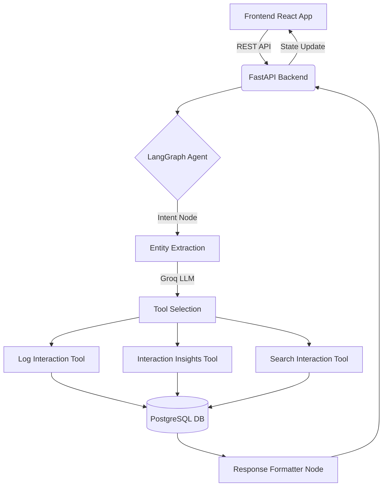

# 🏥 AI-First CRM HCP Module


A production-ready, AI-driven Healthcare Professional (HCP) Interaction Logging CRM designed for pharmaceutical sales representatives. Unlike traditional CRMs, this platform utilizes a sophisticated **LangGraph AI Orchestrator** to automatically extract entities, determine user intent, and intelligently trigger database tools from natural language input.

---

## 🏗 Architecture Diagram



## 📂 Folder Structure

```text
aiova-crm/
│
├── backend/                  # FastAPI Application
│   ├── alembic/              # Database Migrations
│   ├── app/
│   │   ├── api/              # Route Controllers
│   │   ├── core/             # Settings & Config
│   │   ├── db/               # SQLAlchemy Session & Base
│   │   ├── graph/            # LangGraph Workflow (Nodes, Edges, State)
│   │   ├── models/           # DB Schema Models
│   │   ├── schemas/          # Pydantic Validators
│   │   └── main.py
│   ├── tests/                # Pytest Suite
│   ├── Dockerfile
│   └── requirements.txt
│
├── frontend/                 # React 19 Vite Application
│   ├── src/
│   │   ├── components/       # Reusable UI (Sidebar, AIChatView)
│   │   ├── layouts/          # Dashboard Skeleton
│   │   ├── pages/            # LogInteraction View
│   │   ├── redux/            # Global State (interactionSlice)
│   │   ├── services/         # Axios API Client
│   │   ├── theme/            # Material UI configuration
│   │   └── main.jsx
│   ├── Dockerfile
│   └── package.json
│
└── docker-compose.yml        # Full Stack Orchestration
```

## 💻 Tech Stack

- **Frontend**: React 19, Vite, Redux Toolkit, Material UI (MUI), React Router, Lucide React Icons.
- **Backend**: Python 3.11, FastAPI, SQLAlchemy (Async), Alembic, Pydantic V2.
- **Database**: PostgreSQL 15.
- **AI Orchestration**: LangGraph, LangChain, Groq API (`gemma2-9b-it`).
- **DevOps**: Docker, Docker Compose.

---

## 🚀 Installation & Setup

### Environment Variables

Before starting the application, you need to provide a Groq API Key for the LLM to function.
Create a `.env` file in the `backend/` directory or export it in your shell:
```env
GROQ_API_KEY=your_groq_api_key_here
```

### Option 1: Docker (Recommended)
Ensure Docker Desktop is running, then execute:
```bash
docker-compose up --build
```
- **Frontend**: `http://localhost:5173`
- **Backend / Swagger API**: `http://localhost:8000/docs`

### Option 2: Local Development
**Backend**:
```bash
cd backend
pip install -r requirements.txt
alembic upgrade head
uvicorn app.main:app --reload
```
**Frontend**:
```bash
cd frontend
npm install
npm run dev
```

---

## 🧠 How LangGraph Works

The CRM uses a state-machine workflow orchestrator (`backend/app/graph/graph.py`):
1. **Intent Detection**: Analyzes the Rep's message to determine if they are logging, editing, searching, or asking for insights.
2. **Entity Extraction**: Uses the Groq LLM to parse Doctor Name, Hospital, Products, Sentiment, and Action Items into strict JSON.
3. **Tool Execution**: Routes the extracted payload to the relevant Python tool (e.g., `log_interaction_tool` uses `AsyncSession` to write to PostgreSQL).
4. **Validation & Formatting**: The AI synthesizes the DB response into a Markdown-friendly summary for the UI.

## 🤖 How LLM Works

The primary LLM used is **Gemma 2 9B IT** via the fast **Groq API**. It receives strict prompt templates (`backend/app/graph/prompts.py`) that enforce deterministic JSON outputs for entity extraction and tool selection, mitigating hallucination risks.

---

## 📚 API Documentation

FastAPI auto-generates Swagger documentation. Visit `http://localhost:8000/docs` to test endpoints.

- `POST /api/v1/chat/`: The main entrypoint for the LangGraph agent. Accepts natural language, returns structured data and an AI message.
- `POST /api/v1/interaction/`: Direct REST endpoint to save a structured form.
- `GET /api/v1/interaction/history/{hcp}`: Fetches past interactions for a specific doctor.
- `GET /health`: Health check probe for Docker/K8s.

---

## 🗄️ Database Schema

Normalized PostgreSQL Database:
- **`users`**: Sales Representatives
- **`hcp`**: Healthcare Professionals (Doctors)
- **`product`**: Pharmaceutical Products
- **`interaction`**: Logging entity (Duration, Notes, Sentiment)
- **`interaction_products`**: M2M Junction table mapping products to interactions.
- **`followup`**: Action items generated post-interaction.

---

## 📸 Screenshots

*(Placeholders for future UI screenshots)*

- `[Dashboard Layout Placeholder]`
- `[AI Chat Interface Placeholder]`
- `[AI Suggestions Card Placeholder]`

---

## 🔮 Future Enhancements

1. **Voice-to-Text**: Allow reps to dictate their meeting notes directly into the AI Chat View.
2. **Offline Mode**: Cache interactions locally via Service Workers and sync with Postgres when online.
3. **Advanced Analytics**: Integrate Recharts to map regional sentiment scores over time.

---

## 🎥 Video Demo Walkthrough Script (10-15 min)

**[00:00 - 02:00] Introduction**
"Hello! Today I'll be walking you through the AI-First CRM HCP Module. This application fundamentally changes how Pharmaceutical Sales Reps log their data. Instead of endless drop-downs, reps can converse with an AI agent built on LangGraph that automatically logs data to PostgreSQL."

**[02:00 - 04:30] Architecture Overview**
"Let's look at the Architecture. The frontend is built on React 19, Vite, and Redux. Our backend is powered by FastAPI. But the magic happens here, in the LangGraph Orchestrator. When a user sends a message, it traverses through Intent Detection, Entity Extraction using the Groq API (Gemma2-9b), and Tool Execution."

**[04:30 - 08:00] Live Demonstration - The UI**
"I'm now running the app via Docker Compose. Notice the beautiful, premium Material UI design with Google Inter fonts. On the left, we have our classic Form View, but let's switch to the 'AI Chat View'. 
I type: 'Met Dr. Sharma at City Hospital. Discussed CardioX. Doctor loved the efficacy. Need to drop a brochure next Tuesday.'
Notice how Redux instantly updates the chat. The LangGraph agent catches the intent, parses out 'Dr. Sharma', 'City Hospital', the 'Positive' sentiment, and the action item."

**[08:00 - 10:30] Code Deep Dive - LangGraph**
"Let's jump into VSCode. In `backend/app/graph/nodes.py`, you can see the precise prompts we feed to the Groq LLM. Notice our `state.py` file, utilizing `TypedDict`, which perfectly maintains the memory context across the LangGraph lifecycle."

**[10:30 - 13:00] Code Deep Dive - Database & Async Tools**
"In `backend/app/graph/tools.py`, our AI tools aren't just returning mock strings—they inject data straight into our PostgreSQL DB using SQLAlchemy `AsyncSession`. If Dr. Sharma doesn't exist in the `hcp` table, the agent creates him dynamically."

**[13:00 - 15:00] Conclusion**
"This proves that AI-first architectures are the future of Enterprise CRMs. Thank you for watching!"
